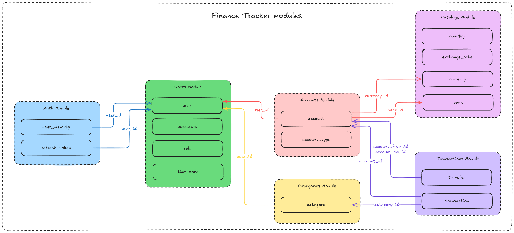

# 📦 Описание модулей

## **1. Users Module**
Управление пользователями, профилями, настройками
- Таблицы: `user`, `user_role`, `role`, `time_zone`

## **2. Auth Module**
Аутентификация и авторизация
- Таблицы: `user_identity`, `refresh_token`

## **3. Accounts Module**
Управление финансовыми счетами
- Таблицы: `account`, `account_type`

## **4. Categories Module**
Управление категориями доходов/расходов
- Таблицы: `category`

## **5. Transactions Module**
Операции (транзакции) и переводы
- Таблицы: `transactions`, `transfers`

## **6. Catalogs Module**
Справочники (валюты, курсы, страны, банки)
- Таблицы: `currency`, `exchange_rate`, `country`, `bank`

# ⚙️ Схема модулей

